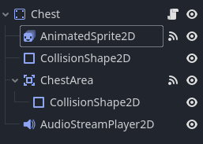
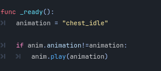
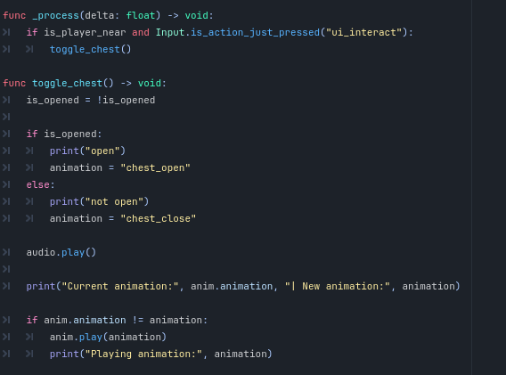
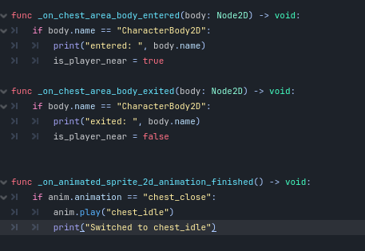
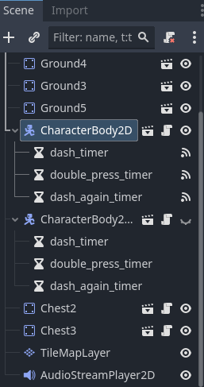
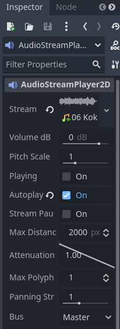

# Implementasi Tutorial 3
## Double Jump
Nilai jump_count akan ditambahkan ketika pengguna menekan arrow up. Jika jump_count masih kurang dari 2, maka pengguna dapat melakukan jump tambahan dan double jump berhasil diimplementasikan.

## Dash
Pertama-tama, function check_double_tap yang menerima input string dibuat terlebih dahulu. Jika terdapat tombol yang ditekan, maka akan dicek apaka timer berhenti atau last_input == action.name. Jika timer berhenti (yang menandakan bahwa pengguna tidak melakukan double click), var is_double_click akan menjadi false dan last_input akan merekam action yang dilakukan, lalu memulai timer. Jika last_input == action_name, maka is_double_click adalah true dan timer akan berhenti.

Dilakukan pengecekan apakah is_double_click bernilai true. Jika iya, maka dashing bernilai true dan velocity_x akan berubah mengikuti dash_speed. Jika tidak, maka velocity_x akan berjalan seperti walk_speed dari player seperti biasa.

## Mengubah Arah sesuai Arah Jalan Karakter
Ketika pemain menekan ui_left, maka akan $Sprite2D.flip_h akan diset menjadi true supaya arah sprite dapat berubah menghadap ke kiri. Jika pemain menekan ui_right, maka $Sprite2D.flip_h akan diset menjadi false supaya arah sprite dapat berubah menjadi menghadap kanan. though in this case i accidentally used the wrong spritesheet, so the difference is not very apparent... :D

## Reference:
https://www.youtube.com/watch?v=DW4CQoYddXQ&ab_channel=CodingQuests
https://www.youtube.com/watch?v=A-Y1zxJ6oH4&t=2s&ab_channel=SRCoder

# Implementasi Tutorial 5
Dalam implementasi objek baru bernama Chest, dibuat beberapa child node untuk StaticBody2D sebagai berikut:

SpriteFrame baru ditambahkan dan beberapa variasi animasi seperti idle, open, dan close dibuat. Untuk masing-masing variasi, aset yang telah disiapkan sebelumnya (diambil dari https://cupnooble.itch.io/sprout-lands-asset-pack) akan diimport ke dalam AnimatedSprite2D. Setelah menyesuaikan frame untuk setiap variasi, maka AnimatedSprite2D telah selesai disiapkan dan akan digunakan di dalam script.

Setelah melakukan import dan menyiapkan global variables untuk beberapa node, maka animasi akan diset. Secara default, animasi akan memutar chest_idle jika tidak terdapat interupsi dari function manapun.

Setelah itu, dilakukan pengecekan kondisi jika player berada di dekat objek chest atau tidak dan juga jika player menekan tombol ui_interact yang dalam kasus ini merupakan tombol space. Hal ini karena player hanya dapat berinteraksi dengan chest jika berada dekat dengan chest tersebut dan player menekan tombol space. Jika memenuhi kedua kondisi tersebut, maka function toggle_chest akan dipanggil.

Dalam function toggle_chest, is_opened akan diubah terlebih dahulu untuk mengganti state dalam chest. Setelah itu, akan dilakukan pengecekan kondisi is_opened yang kemudian akan mengganti variasi animasi menjadi chest_open, begitu pula sebaliknya. Dalam kedua kasus, audio (diambil dari https://pixabay.com/sound-effects/chest-opening-87569/) akan tetap dimainkan ketika pemain berinteraksi dengan objek.

Untuk mengecek apakah player telah memasuki proximity dari object chest, variabel is_player_near akan diset menjadi true jika player memasuki CollisionShape2D dari ChestArea. Sedangkan itu, jika player meninggalkan daerah ChestArea,maka is_player_near akan diset ulang menjadi false untuk melakukan reset pada kondisi.

Jika animasi variasi chest_close telah berakhir, maka akan dilakukan update pada animation untuk kembali menjadi chest_idle supaya animasi akan tetap berjalan, mengingat animasi chest_close tidak memiliki loop. Pemain dapat membuka dan menutup chest sesuka hati dan animasi akan tetap berjalan sebagaimana mestinya.

Untuk mengaplikasikan background music, BGM yang telah disiapkan sebelumnya akan diload ke dalam node AudioStreamPlayer2D. 

Setelah itu, autoplay pada inspector AudioStreamPlayer2D akan dinyalakan sehingga BGM akan terus melakukan looping ketika scene dimainkan.

## Referensi:
https://csui-game-development.github.io/tutorials/tutorial-5/

## Credits:
Sound Effects:
- SFX: https://pixabay.com/sound-effects/chest-opening-87569/
- Background Music: Kokiri Forest Theme - The Legend of Zelda

2D Assets:
- Chest and Character: https://cupnooble.itch.io/sprout-lands-asset-pack

